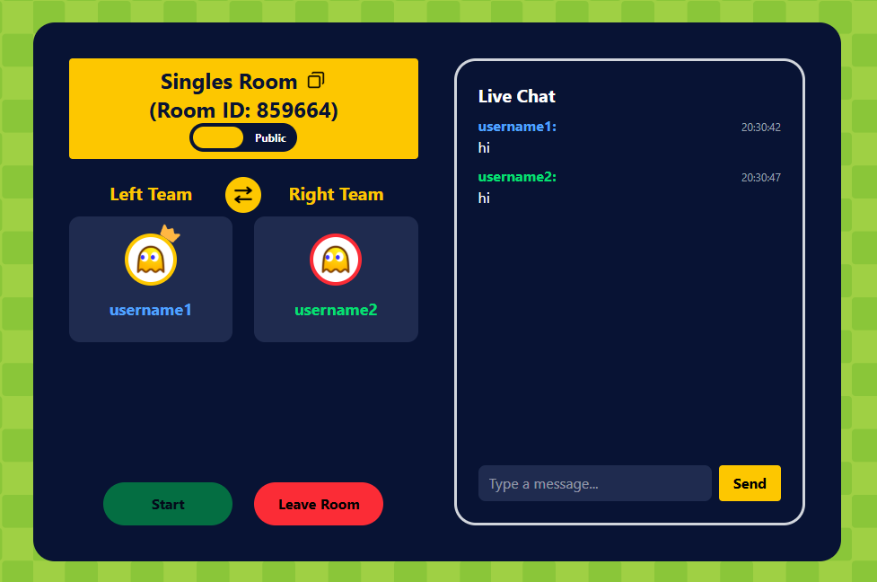
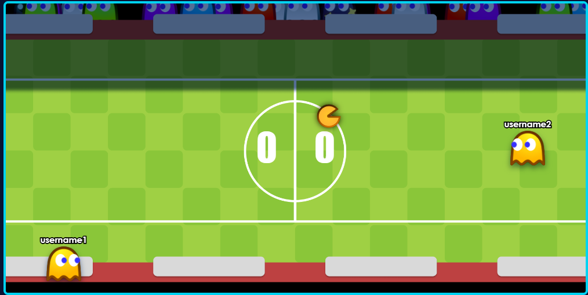

# ft_transcendence 🏓

A full-stack multiplayer Pong game web application built as part of the 42 School curriculum.

---

## 📸 Screenshots

### Title Screen


### Lobby


### Game


---

## ✨ Features

- 🎮 **Game Modes**
  - Local Tournament (up to 4 players on one machine)
  - Online Tournament (real-time multiplayer via WebSocket)
  - Custom Mode (configure ball speed, winning score, and more)
- 👤 **Authentication**
  - Register & login with username/password
  - Google OAuth 2.0 sign-in
  - Two-Factor Authentication (2FA) via OTP
- 🧑‍🤝‍🧑 **Social Features**
  - Friend requests & friend list
  - Block users
  - Real-time online status
  - Live chat with friends
- 🌍 **Internationalization** — English, Simplified Chinese, Traditional Chinese
- 📊 **Profiles** — Avatar, stats, match history, medals
- 🔒 **Security** — JWT-based sessions, bcrypt password hashing

---

## 🛠️ Tech Stack

| Layer     | Technology                              |
|-----------|-----------------------------------------|
| Frontend  | React 19, TypeScript, Vite, TailwindCSS |
| Backend   | Fastify, TypeScript, Prisma, SQLite     |
| Real-time | WebSockets (`@fastify/websocket`, `ws`) |
| Auth      | JWT, Google OAuth 2.0, TOTP (2FA)      |
| Proxy     | Nginx (HTTPS + HTTP)                   |
| Container | Docker, Docker Compose                  |

---

## 🚀 Getting Started

### Prerequisites

- Docker
- Docker Compose

### 1. Clone the repository

```bash
git clone https://github.com/wenjuin95/trancendence.git
cd trancendence
```

### 2. Configure environment variables

```bash
cp .env.example .env
```

Edit `.env` and fill in your values:

```env
HOST=0.0.0.0
PORT=3000
DOMAIN_NAME=localhost          # or your server IP / domain

JWT_SECRET=your_secret_here
JWT_EXPIRES_IN=1h

GOOGLE_CLIENT_ID=your_google_client_id

DATABASE_URL="file:./database/app.db"
```

### 3. Start the application

```bash
docker compose up --build
```

### 4. Open https://localhost:8443 in your browser.

> **Note:** A self-signed certificate is generated automatically for local HTTPS. Your browser may show a security warning — this is expected in development.

---

## 🗂️ Project Structure

```
.
├── backend/         # Fastify API server (auth, game, chat, friends, tournaments)
│   ├── prisma/      # Database schema & migrations (SQLite)
│   └── src/
│       └── modules/ # auth, game, chat, friends, room, tournament, users, …
├── frontend/        # React SPA
│   └── src/
│       ├── views/   # Page-level components
│       ├── components/
│       ├── hooks/
│       └── locales/ # i18n translations
├── nginx/           # Reverse proxy configuration & TLS certs
├── shared/          # Shared types/logic between frontend & backend
├── public/          # Repository screenshots used in this README
├── docker-compose.yaml
└── .env.example
```

---

## 📄 License

This project was created for educational purposes as part of the [42 School](https://42.fr) curriculum.
